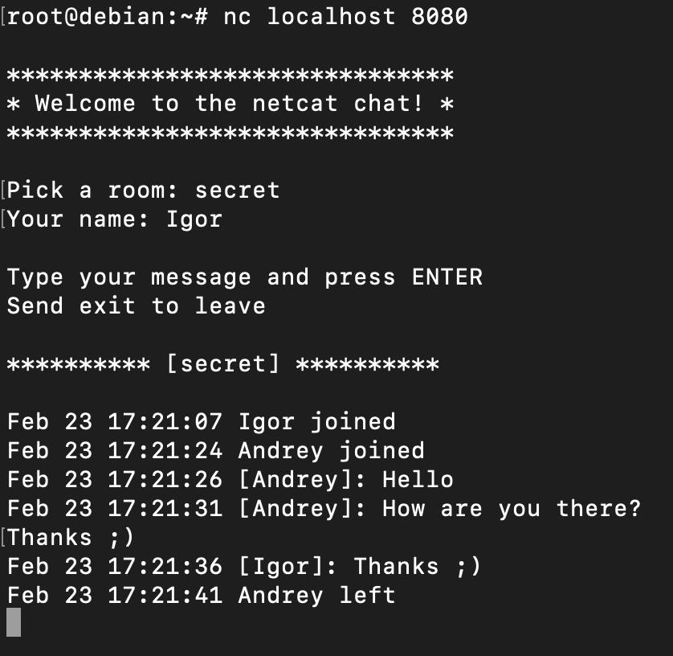
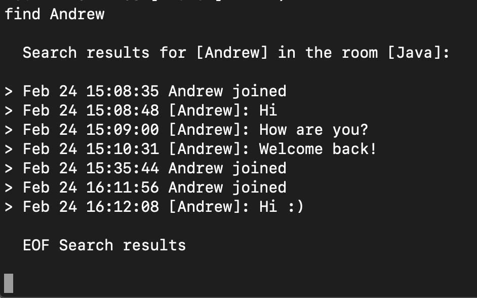

# The simplest netcat chat with rooms and search support

### Running the server:

```nc -lk -p PORT --sh-exec ./chat.sh```

### Connecting to the server:

```nc HOST PORT```

### Chat example:


### Searching for messages:

