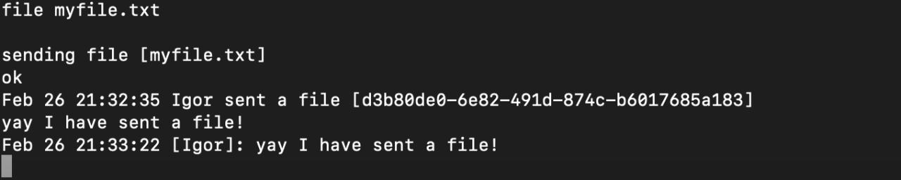

# The simplest netcat chat with rooms and file exchange

### Running the server:

```nc -lk -p PORT --sh-exec ./chat.sh```

### Connecting to the server:

```./client.sh | nc HOST PORT```

###Special commands:

#### dump %path% - sends file lines as chat messages
#### file %path% - sends a file and returns id for downloading
#### load %id or mask% - prints an uploaded file content (visible for receiver only)
#### find %query% - prints messages by a search query (visible for receiver only)
#### exit - quits the chat

### Chat example:


### Searching for messages:


### Sending a file:


### Downloading a file:

